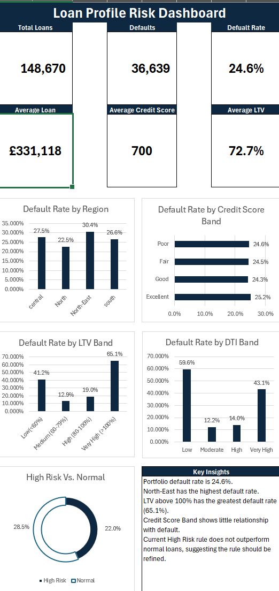

# loan-default-risk-analysis

## Project Overview

This project analyses a dataset of 148,670 mortgage loans to identify borrower and loan characteristics associated with default risk.

The analysis was conducted using **Excel** and **PostgreSQL**, combining dashboard-based exploratory analysis with SQL queries to investigate individual risk factors and develop a simple multi-factor risk segmentation.

## Tools Used

- **Excel** – data analysis, PivotTables, calculated fields and dashboard visualisation
- **PostgreSQL** – querying and analysing loan data
- **SQL** – aggregation, filtering, CASE statements, CTEs and window functions

## Excel Dashboard

The Excel dashboard provides an overview of the loan portfolio and explores how default rates vary across several borrower and loan characteristics.

### Dashboard Findings

- The portfolio contains **148,670 loans**.
- **36,639 loans defaulted**, giving an overall default rate of approximately **24.6%**.
- The **North-East** had the highest regional default rate.
- Loans with **LTV above 100%** had a substantially higher default rate.
- Default rates varied relatively little across credit score bands.
- DTI bands showed considerable differences in default rates.

## SQL Analysis

The SQL analysis extends the dashboard by investigating additional potential risk factors and relationships within the loan portfolio.

The analysis includes:

- Portfolio-level default analysis
- Credit score and LTV analysis
- Income quartile analysis
- Loan purpose and loan type analysis
- Occupancy and loan term analysis
- Multi-factor risk segmentation

The full SQL analysis is available in [`loan_analysis.sql`](loan_analysis.sql).

## Key SQL Findings

Income showed a clear relationship with default risk. Borrowers in the lowest income quartile had a default rate of approximately **35.2%**, compared with **18.7%** for borrowers in the highest income quartile.

Loan type was also associated with default risk, with **type2 loans** displaying a substantially higher default rate than type1 and type3 loans.

Loans with terms between **21 and 25 years** had a particularly high default rate of approximately **53.7%**.

## Multi-Factor Risk Segmentation

Based on the exploratory analysis, three characteristics were selected to construct a simple descriptive risk score:

- Lowest income quartile
- Type2 loan
- Loan term between 21 and 25 years

Each loan received one point for each characteristic present.

| Risk Score | Default Rate |
|------------|-------------:|
| 0 | 19.85% |
| 1 | 30.75% |
| 2 | 46.50% |
| 3 | 72.40% |

Default rates increased substantially as additional risk characteristics were present, suggesting that combining multiple factors provides more useful risk segmentation than considering individual characteristics alone.

## Skills Demonstrated

- Exploratory data analysis
- Risk analysis
- Excel dashboard development
- PivotTables and calculated metrics
- SQL querying
- Aggregate functions
- `CASE` statements
- Common Table Expressions (CTEs)
- Window functions and `NTILE()`
- Data segmentation
- Translating analysis into business insights

## Limitations

The risk score is descriptive rather than a validated predictive model. The selected factors were identified using the same dataset on which the risk score was evaluated, so further validation would be required before using the results for lending or credit-risk decisions.

Some variables also contain extreme or unusual values, particularly LTV, and several categorical variables use coded labels whose underlying business definitions would need to be confirmed.
